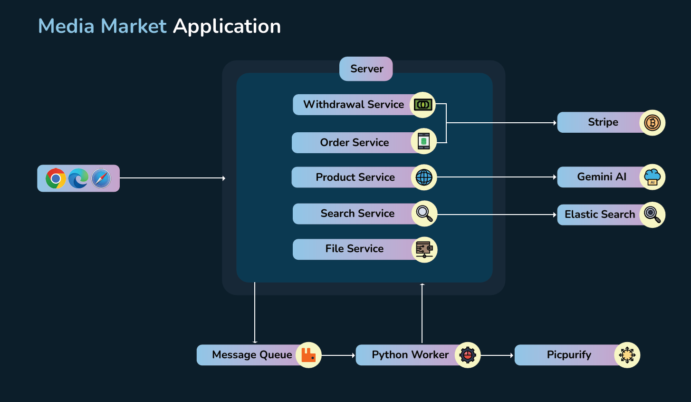

## Media Market application
Media Market is an online content marketplace where users can be both sellers and customers. It also features integrated online content moderation powered by Picpurify.
This project is for me to implement some patterns like Dependency Injection, Observer Pattern, Inversion of Control, etc., and learn more technologies to support my work.
### Technologies and Frameworks
- .NET 8
- ASP.NET 8
- Next.js
- RabbitMQ
- Elasticsearch
- Python

### Architecture
Media Market is designed with a modular architecture that ensures optimal performance. The system prioritizes asynchronous task processing, leveraging message queues to enhance scalability and responsiveness.


### Project structure
```
src/
|── backend/
|   |── MediaMarket.API
|   |   |── Controllers
|   |   |── Storage                     # Store logs and upload files in local development
|   |── MediaMarket.Application
|   |   |── Bases                       # Base model
|   |   |── Contracts                   # System interfaces
|   |   |── DTO                         # Data transfer object
|   |   |── Events                      # All Events in the system
|   |   |── Extensions                  # Application extensions
|   |   |── Listeners                   # Listeners for Events
|   |   |── Mappings                    # Register data mapping for AutoMapper
|   |   |── Services                    # Implement business logic based on Interfaces
|   |── MediaMarket.Domain
|   |   |── Common                      # Common for Domains
|   |   |── Entities
|   |   |── EntityConfigurations        # Schema configuration for Entities
|   |   |── Enums
|   |   |── Exceptions
|   |── MediaMarket.Infrastructure
|   |   |── Cache                       # Implement and Register Cache for the System
|   |   |── Data                        # Configure Application DB Context
|   |   |── Event                       # Implement Event-Listener pattern
|   |   |── Extensions                  # Infrastructure extensions
|   |   |── GenerativeAI                # Implement Generative AI Models
|   |   |── Interceptors                # Implement Interceptors (e.g., Entity Framework)
|   |   |── Messaging                   # Implement Publisher and Consumer
|   |   |── Migrations                  # Migrations for entity framework
|   |   |── Payment                     # Implement payment services
|   |   |── Repositories                # Implement Repository Layer for Entity Framework
|   |   |── Search                      # Implement Search engine (e.g., Elasticsearch)
|   |   |── Seeders                     # Seeding database
|   |   |── Services                    # Other Services (e.g., Get Current User, Generic Handler for DI)
|   |   |── Storage                     # Implement File Storage
|── frontend/
|── worker/file-worker/
|   |── utils                           # Libraries for file processing in python
|   |── main.py                         # Listen and process queue
```